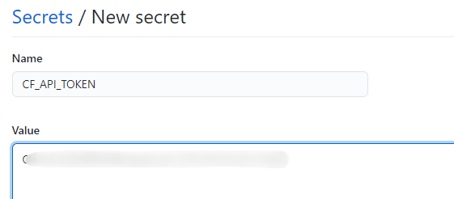

前几天Cloudflare将Workers KV增加了免费额度，还不得搞起来？

利用Workers KV存储网页内容，通过Workers将内容返回给用户，就等于将自己的网站直接部署到CF成千上万的边缘节点当中，全球访问速度和TTFB都应该不错

https://blog.cloudflare.com/workers-sites/

## 安装Wrangler

[官方文档](https://developers.cloudflare.com/workers/cli-wrangler/install-update)

Wrangler有两种安装方式，通过NPM或者Cargo安装都可以，任选其一即可

准备好NodeJS和NPM环境，然后执行下面命令，NPM方式是下载预编译好的二进制程序，安装速度比较快

```shell
npm i @cloudflare/wrangler -g
```

或者准备好Rust环境，然后执行下面命令，Cargo方式是在本机从源码编译，安装速度比较慢

```shell
cargo install wrangler

# 使用系统OpenSSL库，生成的二进制会小一些
cargo install wrangler --features sys-openssl
```

## 部署

我自己博客使用的是Hugo，下面所有内容都是按照Hugo的方式来，其他静态站点生成器方法类似

### 登录

```shell
wrangler login

# 手动设置token
wrangler config
```

### 初始化

进入自己站点的目录，执行下面命令进行初始化。这里Wrangler会自动安装cargo-generate工具，在本目录下创建一个`workers-site`项目目录，然后生成一个`wrangler.toml`配置文件

```shell
wrangler init --site
```

打开`wrangler.toml`文件，按照自己的信息进行修改

`account_id`和`zone_id`都可以从Cloudflare官网上找到，`route`是路由到Workers的规则，这里写你需要绑定的域名，不要忘记后面的`/*`

`bucket`是网站的目录，因为我用的是Hugo，所以这个目录默认是`public`

`entry-point`是部署到Workers的js代码目录，这里不需要修改，因为刚刚初始化的时候生成的项目目录名已经自动填写上了

```toml
name = "blog"
type = "webpack"
account_id = "eu5d123456789987456321aabcddgeh"
workers_dev = true
route = "cf.lgf.im/*"
zone_id = "fhidag8u98f43h93fhiohr929c8d59efhauh"

[site]
bucket = "public"
entry-point = "workers-site"
```

### 预览

```shell
wrangler preview --watch
```

### 发布

在Cloudflare中增加一条DNS记录，需要打开CF代理


执行下面命令进行部署

```shell
wrangler publish
```

## 使用Github Actions持续集成

Cloudflare提供了官方的[Wrangler GitHub Action](https://github.com/marketplace/actions/deploy-to-cloudflare-workers-with-wrangler)，可以直接用Github Actions将博客内容部署到CF Workers Site

### 添加认证信息

在github仓库设置一个secret，名字为`CF_API_TOKEN`，值为Wrangler的token



### Workflows

```yml
name: hugo

on:
  push:
    branches:
      - master

jobs:
  deploy:
    runs-on: ubuntu-18.04
    steps:
      - uses: actions/checkout@v2
        with:
          submodules: true
          fetch-depth: 0

      - name: Setup Hugo
        uses: peaceiris/actions-hugo@v2
        with:
          hugo-version: '0.78.2'
          extended: true

      - name: Build
        run: hugo --minify

      - name: Deploy
        uses: peaceiris/actions-gh-pages@v3
        with:
          github_token: ${{ secrets.GITHUB_TOKEN }}
          publish_dir: ./public

      - name: Publish
        uses: cloudflare/wrangler-action@1.3.0
        with:
          apiToken: ${{ secrets.CF_API_TOKEN }}
```
