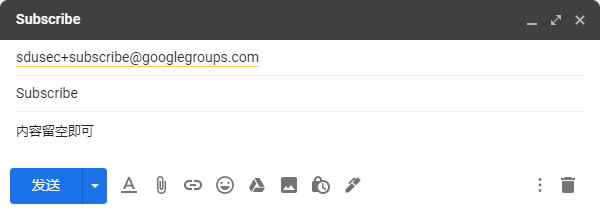
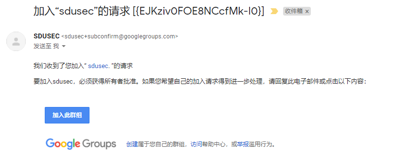

> 之前经常听说或者在新闻里见到邮件列表这个词，知道很多大佬，特别是计算机大佬、某某编程语言之父、某某操作系统之父等一堆大佬都在用邮件列表，就感到十分好奇。近期我特意上网搜索相关资料，亲身实践邮件列表的使用

## 什么是邮件列表

邮件列表（Mailing List）的起源可以追溯到1975年，是互联网上最早的社区形式之一，也是Internet上的一种重要工具，用于各种群体之间的信息交流和信息发布

邮件列表根据不同作用分为不同形式，其实我们生活中也有接触和使用过邮件列表这个东东，只是自己不知道这个东西就要邮件列表而已

### 常见的邮件列表有六种形式

- 电子刊物
- 新闻邮件
- 注册会员通讯
- 新产品通知
- 顾客服务/顾客关系邮件
- 顾客定制信息

### 根据不同的邮件分发方式，邮件列表可以分为两大类

- 公告型(Announcement list)
- 讨论型(Discussion list)

**公告型** 顾名思义就是类似于公告板，管理员可以给邮件列表所有成员发送公告邮件，比如我们常见的 广告邮件、新闻邮件、通知邮件等

**讨论型** 通俗点讲，就是一堆人加入一个列表中，这个列表有一个公用的邮箱地址，你可以给这个邮箱地址发邮件，他会自动将邮件转发给列表中的每一个人，列表中的成员可以直接通过回复邮件参与讨论，讨论内容同样会被转发给每一个人

公告型邮件列表我们在生活中经常用，不需要多说，这篇文章我们主要来实践 讨论型 邮件列表的使用

> 下面提到的邮件列表一词特指讨论型邮件列表

## 哪里用到邮件列表

其实很多地方会用到邮件列表，特别是在计算机领域，很多大佬喜欢用。他们认为网页论坛内容杂乱，无法进行深入、高效的交流，内容往往缺乏思考和谨慎。邮件就恰恰相反，发邮件时我们往往会进行慎重思考，深思熟虑之后写一长篇文章，这样最有利于交流

QQ邮箱中会看到群邮件功能，这其实就是一个讨论型的邮件列表功能。但这一功能实际上只有极少一部分人充分利用了起来，绝大多数群并没有有效的利用。这个功能现大多沦为广告和病毒木马多发地，真是令人惋惜

Debian、维基百科等大型组织大都自己搭建邮件列表服务，而大部分中小组织都时直接使用Google Group提供的服务，Google Group应该拥有最多的邮件列表

现在Github仓库的Issue功能也与邮件列表差不多了，watching该仓库的人可以收到对应的邮件，也可以通过邮件进行回复

## 如何使用邮件列表

接下来我们实践如何加入一个邮件列表、在邮件列表中发起讨论、参与邮件列表中已经发起的讨论、退出邮件列表等常用操作

### 加入邮件列表

加入一个邮件列表有两种方法:

1. 通过在**网页**填写自己的邮箱地址加入
2. 比较正统的方法，通过**发送邮件**加入

我们以 **sdusec@googlegroups.com** 这个邮件列表为例，演示如何加入它

邮件列表有一个主邮箱地址，同时有一些辅助邮箱地址，通过发送邮件加入邮件列表需要使用 **sdusec+subscribe@googlegroups.com** 这个辅助邮箱地址

在Google Group中订阅一个邮箱列表可以给 **邮件列表名+subscribe@googlegroups.com** 这个邮箱地址发任意邮件，这里需要注意不能省略加号

在发送邮件后就会收到邮件列表的确认邮件，按照提示回复或点击按钮即可成功加入，对于Google Group我们回复`confirm`进行确定

然后我们就会收到加入成功的通知，有些列表需要管理员进行审核，等待即可

一些其他类型邮箱列表的加入方式可能稍有不同，其中有一部分需要发送主题为 **subscribe** 的邮件才能加入，同时订阅的邮箱地址不是**+subscribe**，而是**-subscribe**，这里是减号

> 这里介绍的是通用方法，可能与某些邮件列表的方法不符，在尝试加入一个邮件列表之前你需要通过说明页面查看具体的订阅方法

### 发起讨论

在邮件列表中发起讨论也是通过发送邮件来实现的，将讨论的内容发送给公共的邮箱地址，例如发送给**sdusec@googlegroups.com**，邮件列表服务器就会将你的邮件发送给订阅该列表的每一个人

注意，不要往主邮箱地址发送垃圾内容，否则会引起大家的反感。同时，在发起讨论前你要精心编辑问题内容和标题，发布高质量的讨论而不是垃圾

### 参与讨论

如果你收到一封邮件，想要参与讨论，只需要回复这封邮件

一般情况下我们使用的邮件服务会自动将标题重命名为 `Re: 原标题`或者`回复：原标题`的格式，同时正文内容中会引用被回复的邮件内容。如果你是用的邮箱系统不支持这个操作，建议切换至Gmail

> 注意，点击发送前观察你回复的是不是公共邮箱，只有这样其他人所有人才能看到你回复的内容
> 如果回复内容只想让部分人可见，需要手动指定回复的邮箱地址

### 退订邮件列表

与加入方式类似，需要将**subscribe**换成**unsubscribe**

## 如何用好邮件列表

使用邮件列表非常简单，但是想要用好还是得花点功夫。无论是邮件的标题还是内容，都需要精心准备，否则会被列表中的其他人视作垃圾或问题被忽视

### Email格式

- 设置好签名档
- 公务邮箱应该包括姓名, 公司名称, 地址, 传真, 联系方式等
- 私人邮箱包括姓名(如经常与国外往来,应使用拼音或英文名), 邮箱地址, blog等必要信息
- 清晰简明的标题，30字以内, 尽可能的包含5W1H
- 可以添加标签, 方便收件人客户端自动分类.如, 通知, 汇报等
- 抬头, 落款

### 内容表述

- 倒金字塔叙事
- 开头讲清楚概括大意, 讲清楚5W1H
- 慢慢展开，旁征博引

#### 5W1H

- who 谁
- When 何时
- Where 何地, 或什么过程中
- What 遇到了什么问题
- Why 为何会出现这个问题
- How 如何,或进行过怎样的尝试, 以及其他方便他人理解问题的信息

### 提问的智慧

#### 提问之前

- Google it
- 询问精通此道的身边人
- 三思而后问

#### 怎样提问

- 语法正确, 拼写无误
- 精确描述, 信息量大
- 只说症状, 不说猜想
- 问题解决后要有简短声明
- 具体参见http://wiki.woodpecker.org.cn/moin/AskForHelp...
- 附件文档请输出为pdf版

### 避免邮件出现乱码

- 注意编码格式，使用utf-8编码, 不要使用GBK之类的编码
- 避免中文标点
- 使用常见的emoji，避免使用生僻的图标

### 防止线索断开

在使用邮件列表的过程中，会遇到**线索断开**的情况

当看到有人提到线索断了的时候，就需要检查自己回复的邮件，标题是否有 `RE原邮件` ，内容中是否有引用被回复的邮件

正常情况下你使用的邮件软件会自动完成这些内容，如果没有那你得考虑更换邮件软件或者服务

## 一些邮件列表

https://lists.wikimedia.org/mailman/listinfo
