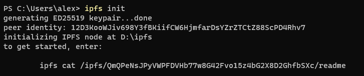

**IPFS**全称`InterPlanetary File System`，中文名叫**星际文件系统**，听起来非常酷炫。

它是是一个旨在创建持久且分布式存储和共享文件的网络传输协议，是一种内容可寻址的对等超媒体分发协议。在IPFS网络中的**全球所有**节点将构成**一个**分布式文件系统，全球中的每一个人都可以通过IPFS网关存储和访问IPFS里面的文件。

这个酷炫的项目最初由Juan Benet设计，自2014年开始由Protocol Labs在开源社区的帮助下发展，是一个完全开源的项目。

- [IPFS官网](https://ipfs.io/)
- [GitHub](https://github.com/ipfs)

## IPFS的功能

IPFS宣称，无论你现在在用已有的Web技术干什么，IPFS都可以做到更好。


- 对于**归档人员**

    IPFS提供了数据块去重、高性能和基于集群的数据持久化，这有利于存储世界上的信息来造福后代

- 对于**服务提供商**

    IPFS提供安全的P2P内容交付，可以为服务提供者节省数百万带宽成本

- 对于**研究者**

    如果您使用或分发大型数据集，IPFS可以帮助您提供快速的性能和分散的归档


- 对于**世界发展**

    对于那些互联网基础设施较差的人来说，高延迟网络是一大障碍。IPFS提供对数据的弹性访问，独立于延迟或主干网连接

- 对于**区块链**

    使用IPFS，您可以处理大量数据，并在事务中放置不可变的永久链接—时间戳和保护内容，而不必将数据本身放在链上

- 对于**内容创造者**

    IPFS充分体现了网络的自由和独立精神，可以帮助您以更低的成本交付内容

## 工作原理

让我们通过向IPFS添加一个文件这个过程，来简单看一下IPFS是如何工作的


首先，IPFS将文件切割为多个小块，块的数量由文件的大小决定。然后计算每个块的Hash，作为这个块的指纹。


然后，IPFS会进行查重。因为很多文件数据有重复的部分，在切割成小块后，这些小块有的会完全相同，表现出来就是指纹Hash相同。

在IPFS的设计中，完全相同的块IPFS网络中只保留一份。这不是说一个块只有一个节点存储，而是说对于内容完全相同、指纹Hash完全相同的块，网络中已经有了就不需要再次上传、不需要再次当作一个新内容块来处理了。这就保证了通过一个指定的CID，我们就可以从IPFS网络上获取到唯一的那个数据块。


IPFS网络中的每一个节点只存储自己**感兴趣**的内容，也就是该IPFS节点的使用者经常访问、或指定要固定的内容。

除此之外还需要额外存储一些索引信息，这些索引信息用来帮助文件查找的寻址工作。当我们需要获取某个块的时候，索引信息就可以告诉IPFS这个特定块在哪些节点上有存储。


当我们要从IPFS中查看或者下载某个文件时，IPFS便要通过改文件的**指纹Hash**查询索引信息，并向自己连接的节点进行询问。这一步需要找到IPFS网络中的哪些节点存储着自己想要的文件数据块。


如果你无法记住IPFS中存储的文件的指纹Hash(是一段非常长的字符串)，实际上你也无须记住这个Hash，IPFS提供了**IPNS**来提供**人类可读名字**到**指纹Hash**之间的映射，你只需要记住你添加在IPNS中的人类可读名字即可。

## 基本使用

### 安装

设置环境变量`IPFS_PATH`，这个目录在后面进行初始化和使用的时候会作为IPFS的本地仓库。如果这里不进行设置，IPFS默认会使用用户目录下的`.ipfs`文件夹作为本地仓库。


#### 初始化

运行命令 `ipfs init` 进行初始化，这一步会初始化密钥对，并在刚刚指定的`IPFS_PATH`目录创建初始文件。



#### 检查可用性

通过显示的命令来检查可用性，这里使用`ipfs cat`命令来查看指定的`CID`对应的内容。


#### 开启守护进程

运行下面命令开启守护进程

```powershell
ipfs daemon
```

### 获取文件(夹)

### 添加文件(夹)

### 使用IPNS

## 在IPFS部署网站

既然IPFS宣称能够构建新一代分布式Web，那我们便想要把自己的网站部署到IPFS上去

### 将文件添加到IPFS中

我使用的是Hugo静态网站生成器生成我的博客，生成的内容存放在`public`目录下，所以首先我需要将`public`目录及其里面的所有内容添加到IPFS中。

```powershell
# -r 参数代表递归添加
ipfs add -r public

# 实际运行效果
PS D:\blog> ipfs add -r public
added QmUefJXxEvRgQTfDJSKA9bjua2GP5iqV8YdrPf8pYwjChD public/about/index.html
added QmZPy9wc92kpFvzf53AMHKiHcZmFG6wNu3ampBjkeuzCHv public/about/index.md
很长的滚屏后......
added QmdjMP28LPesg9C1aLste2vyajoca75J52Cvjavhu6XZsE public/tags
added QmUXRdUs4aAwV6ayFu7ps3TYdVqgHf6JeETDYYQUFnVHGv public
 35.12 MiB / 35.12 MiB [===========================================] 100.00%
```

### 通过IPFS网关访问

在刚刚添加完成的最后，名称为`public`的那串Hash便是public目录的CID，我们现在可以通过这个CID在IPFS网关上访问我们刚刚的添加的内容。


#### 本机网关验证

我们先通过本机的IPFS网关来访问一下，看看有没有添加成功。注意这一步需要你本地已经开启了IPFS守护进程。

如果你发现仅仅访问单个文件，能够正常访问到


但是访问整个网站，内容可以显示，但是样式出现了错误。


这是因为我的样式使用的是**绝对地址**，不能通过这样一种简单访问单个文件的方式来使用

这个时候我们需要借用IPFS提供的Web面板来进行，如果你没有修改配置文件，那Web面板的地址为：[http://127.0.0.1:5001](http://127.0.0.1:5001)


在浏览页面，粘贴刚刚`public`对应的CID，浏览目录内容，然后在右侧的More按钮中点击`Inspect`


在Inspect页面，你能看到该CID对应文件的块信息，这里我们点`在IPFS网关上查看`按钮


你会发现网站的内容和样式显示正常了。


你会发现浏览器地址栏的网址为一个另一个**长字符串**构成的域名

长字符串.ipfs.localhost:8080

这里的长字符串是IPFS中的另一个概念：IPLD


## 相关概念

在IPFS里面有很多概念需要了解

### Peer

### CID

### IPNS

### IPLD

## 底层技术

### Merkle有向无环图（DAG）

每个Merkle都是一个有向无环图 ，因为每个节点都通过其名称访问。每个Merkle分支都是其本地内容的哈希，它们的子节点使用它们的哈希而非完整内容来命名。因此，在创建后将不能编辑节点。这可以防止循环（假设没有哈希碰撞），因为无法将第一个创建的节点链接到最后一个节点从而创建最后一个引用。

对任何Merkle来说，要创建一个新的分支或验证现有分支，通常需要在本地内容的某些组合体（例如列表的子哈希和其他字节）上使用一种哈希算法。IPFS中有多种散列算法可用。

输入到散列算法中的数据的描述见 https://github.com/ipfs/go-ipfs/tree/master/merkledag

### 分布式散列表DHT

## 上层应用

IPFS作为一个文件系统，本质就是用来存储文件，基于这个文件系统的一些特性，有很多上层应用涌现出来。


## Filecone


## 基于IPFS构建应用

IPFS提供了IPFS协议的**Golang**和**JavaScript**实现，可以非常方便的将IPFS集成到我们的应用当中，充分利用IPFS的各种优势。

## 参考资料

- [IPFS官网](https://ipfs.io/)
- [IPFS文档](https://docs.ipfs.io/)
- [IPFS博客](https://blog.ipfs.io/)
- [维基百科：星际文件系统](https://zh.wikipedia.org/wiki/%E6%98%9F%E9%99%85%E6%96%87%E4%BB%B6%E7%B3%BB%E7%BB%9F)
