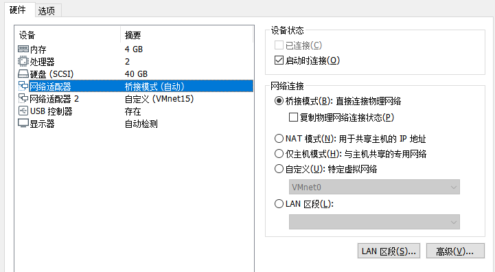
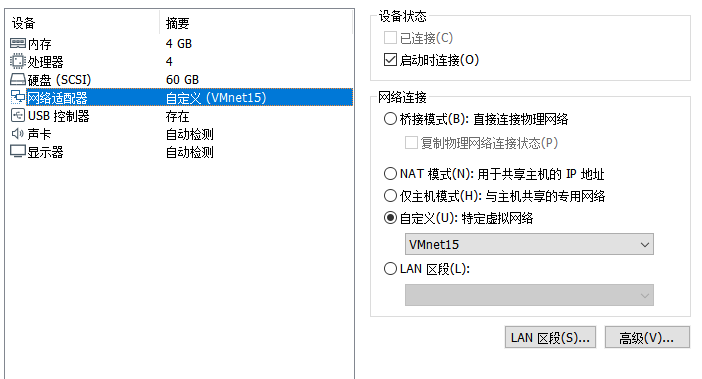
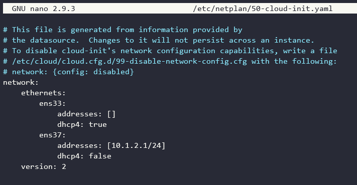

# 使用iptables将ubuntu配置为路由器


## 实验环境

> 使用 vmware 分别创建win7和ubuntu两个虚拟机

### ubuntu 18.04

充当网关路由器

网卡1(WAN口)：桥接公网

网卡2(LAN口)：vmnet15



### win7

充当内网客户机

网卡：vmnet15

> vmnet15不使用vmware的配置，使用一个空的vmnet



## ubuntu 配置

### 开启ipv4 forward

修改 `/etc/sysctl.conf` 开启ipv4的forward功能，将下面的注释打开，如果没有手动添加。


`sysctl -p` 生效

### 配置网卡信息

`ip addr` 查看所有网卡的名称和信息

ubuntu18.04使用netplan管理网络，修改其配置文件

`sudo nano /etc/netplan/50-cloud-init.yaml`



使用 `netplan try` 检查配置是否正确，如果正确自动应用生效

### 配置iptables规则

```shell
//清空已有规则防止干扰
iptables -F

//进、出、转发默认允许
iptables -P INPUT ACCEPT
iptables -P FORWARD ACCEPT
iptables -P OUTPUT ACCEPT

//将从子网网段来的连接nat到eno33网卡(互联网)，ip改为外网ip
iptables -t nat -A POSTROUTING -s 10.1.2.0/24 -o eno33 -j SNAT --to-source 192.168.254.129

//添加伪装
iptables -t nat -A POSTROUTING -s 10.1.2.0/24 -j MASQUERADE
```

## win7 设置

修改网卡配置如图


win7即可通过ubuntu这个网关上网

